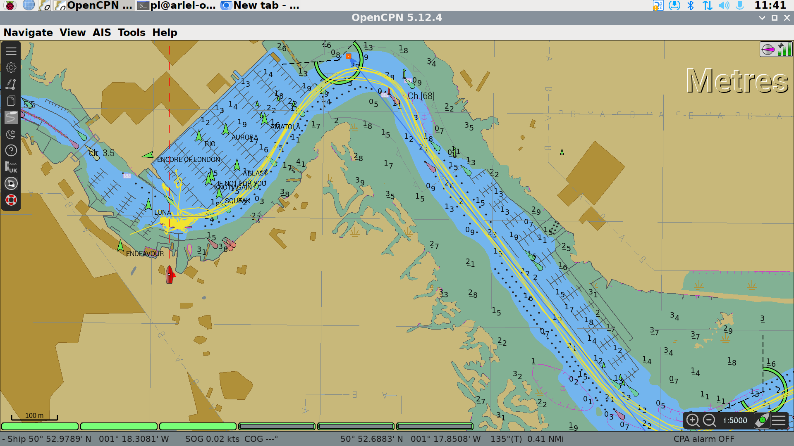

# Basic Use of OpenCPN Plotter

## Interface Overview

OpenCPN is an open source chartplotter maintained and improved by a large community of world-wide users.  It is freely available to download and we encourage club members to download and run it locally to allow them to practice how it is used and to allow them to plan routes, waypoints etc. in advance.

This is a graphic of the main interface:

The large text "Metres" identifies the units used in the soundings depths shown on the chart.

In the top right corner, there is a satellite signal strength indicator showing the reliability of the position data, and an icon which informs if the plotter is in North up or Course up mode.

In the bottom right corner are the zoom controls of the chart, a button to pan the chart so Ariel is at the centre (boat with green dot) and a button to bring up the chart display options.

At the bottom left of the display, there are a number of green bars - these represent the charts that cover the area displayed.  The chart plotter blends data from a number of charts to best show required data.  This is known as "Chart-Quilting".  The charts used will change as you zoom in and out and as you pan or change the chart settings.  In this example 3 of the 6 charts are being used in the display.  *Please leave chart-quilting enabled - we have set the chart detail level to what we believe is a very useful compromise - readable on a 14" screen, showing all hazards and most depth soundings.*

In the top left corner is the menu bar.  The top icon expands and contracts the menu.  

The second icon opens the Options menu.  *Please do not change anything in the options menu.* 

The third icon allows you to create a route.  

The fourth icon opens the routes, tracks and waypoints manager, allowing you to name routes, add organise waypoints, import routes and waypoints from file etc.

The fifth icon toggles track recording on and off.

The sixth icon toggles between daytime, dusk and nighttime colour schemes.

The seventh icon opens the help dialogue.

The eigth icon allows the user to download and view UK tidal data.

The ninth icon opens an AIS Radar so you can see AIS targets without the distraction of the chart items.

The final icon will drop a MOB waypoint.

## Chart Display Options 

## Zooming and Panning

## Getting Information on Chart Item

## Measuring Distance on Chart

## Adding Waypoints

## Creating and Activating a Route

## Managing Routes, Tracks and Waypoints

## Course-up Mode

## Showing AIS Targets

