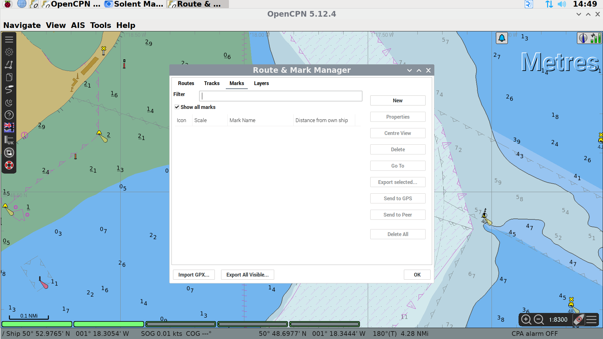
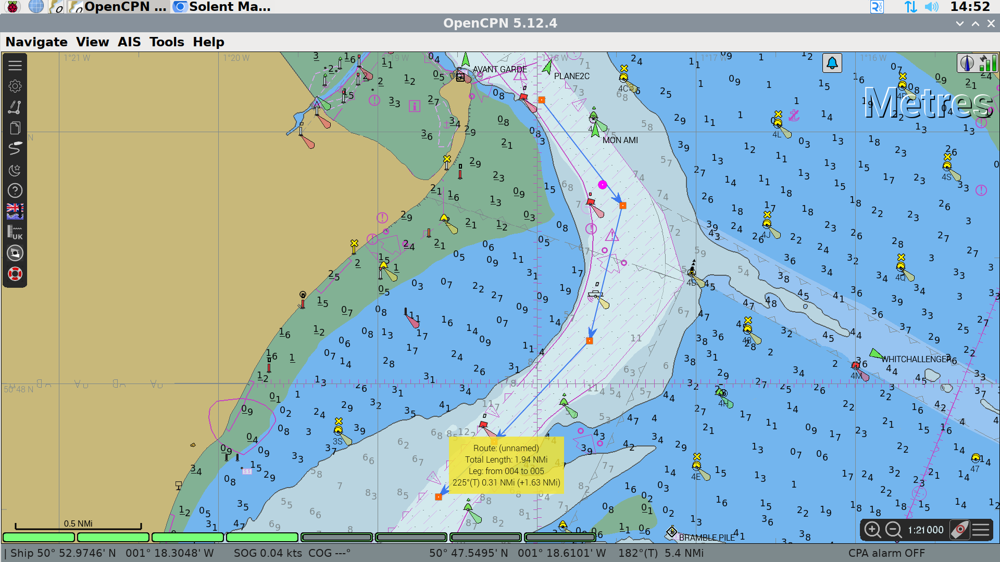

# Basic Use of OpenCPN Plotter

## Interface Overview

OpenCPN is an open source chartplotter maintained and improved by a large community of world-wide users.  It is freely available to download and we encourage club members to download and run it locally to allow them to practice how it is used and to allow them to plan routes, waypoints etc. in advance.

This is a graphic of the main interface:

The large text "Metres" identifies the units used in the soundings depths shown on the chart.

In the top right corner, there is a satellite signal strength indicator showing the reliability of the position data, and an icon which informs if the plotter is in North up or Course up mode.

In the bottom right corner are the zoom controls of the chart, a button to pan the chart so Ariel is at the centre (boat with green dot) and a button to bring up the chart display options.

At the bottom left of the display, there are a number of green bars - these represent the charts that cover the area displayed.  The chart plotter blends data from a number of charts to best show required data.  This is known as "Chart-Quilting".  The charts used will change as you zoom in and out and as you pan or change the chart settings.  In this example 3 of the 6 charts are being used in the display.  *Please leave chart-quilting enabled - we have set the chart detail level to what we believe is a very useful compromise - readable on a 14" screen, showing all hazards and most depth soundings.*

In the top left corner is the menu bar.  The top icon expands and contracts the menu.  

The second icon opens the Options menu.  *Please do not change anything in the options menu.* 

The third icon allows you to create a route.  

The fourth icon opens the routes, tracks and waypoints manager, allowing you to name routes, add organise waypoints, import routes and waypoints from file etc.

The fifth icon toggles track recording on and off.

The sixth icon toggles between daytime, dusk and nighttime colour schemes.

The seventh icon opens the help dialogue.

The eigth icon allows the user to download and view UK tidal data.

The ninth icon opens an AIS Radar so you can see AIS targets without the distraction of the chart items.

The final icon will drop a MOB waypoint.

## Chart Display Options 

The chart display options can be accessed by clicking on the three horizontal bars on the menu bar on the bottom right of the screen, near the zoom buttons and the centre on boat button.

## Zooming and Panning

There are two different ways to pan the chart that is being displayed.  The first, move the mouse pointer to edge of chart,  the mouse pointer will turn in to green triangle.  Once the green triangle is shown, click the left mouse button and the chart will move.  Secondly, the chart can be dragged using the mouse.  Click and hold the left mouse button and then move the mouse, the chart will move with the mouse.

To zoom the chart in or out, there are two alternatives too.  The user can use the mouse wheel to zoom in or out, or they can use the icons + or - on the control panel at the bottom right of the screen.

## Getting Information on Chart Item

One of the key items that more modern chart plotters offer is a large quantity of data about items on the screen.  You can get flash patterns, descriptions of the structure of a light, warnings etc. 

To view the information, right click the mouse on the specific item.

From the pop up menu, select Object Query.

## Measuring Distance on Chart

Distance and direction can be measured between any two points on the chart.  To start a measurement, right click with the mouse and select measure (or press letter M on keyboard).

Left click with the mouse at first point, then move the mouse to the second point and read off the distance and direction.  The screen will auto-pan if you're move the mouse to the edge of the chart whilst measuring.

## Adding Waypoints/Marks

There are two methods to add waypoints in OpenCPN.  To navigate to a waypoint *CHECK*

### Import a file

The first method uses a standard file format called GPX which can store waypoints, routes or tracks.  These can be exported from most GPS related software so you can plan at home and import to OpenCPN.

Open the Mark Manager from the control panel on the left hand side of the plotter screen.  Click on the Marks tab, and at the bottom of the manager box click Import GPX.  Alternatively, marks can be imported as a layer, which can be turned on and off en masse.  Currently, we have layers for the Solent Racing Marks and Dartmouth regatta marks.

### Via chart

When adding marks via the chart, right click the mouse at the point where you want to add a waypoint and click Drop Mark.

To name the waypoint or to change the icon, go to mark manager, navigate to the marks tab and click on the relevant waypoint. Click Properties on the right hand of the panel and change the name, location or icon.  Remember to press Save.

*Any waypoints which are not named will be deleted on a monthly basis.*

## Creating and Activating a Route

Similar to waypoints, routes can be imported from a GPX file that has been created in advance.

To create a route, start by right clicking the mouse on the chart and select New route.

Click at each point on the route.  To finish making the route *CHECK*

To start using the route, either right click the mouse on the route and click Activate, or open route manager, navigate to the routes tab and click activate.  The route can also be named by clicking on Properties in the route manager.

*Any routes which are not named will be deleted on a monthly basis.*

## Course-up Mode

Chart up mode can be enabled by clicking on the Arrow next to the satellite signal level indicator on the control bar at the top right of the display or via the chart control pop-up that is accessed by clicking the three horizontal bars at the bottom left of the display.

*This does slow the chart rendering and is not recommended.*

## Showing AIS Targets

AIS targets can be switched on and off using chart inoformation control pop-up that is accessed by clicking the three horizontal bars at the bottom left of the display.  Please ensure that this is left on for the next skipper and crew.

To view more details about an AIS target, such as size, speed, destination, you can right click the mouse on the vessel icon and then click AIS Target Query.

NB there are two classes of AIS user, class A and class B.  Class B are smaller craft, like Ariel, and do not transmit the same level of detail as a class A user.

