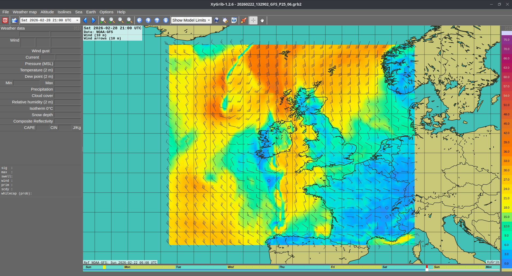

# Other Useful OpenPlotter Software

## XyGrib

XyGrib is an open source software package designed to download and display weather forecast in a compressed format that doesn't require much data.

To download data, use the mouse to click and drag a square over the area of interest and then click the download button on the icon bar (next to the Show Model Limits drop-down).  You'll then be able to choose the model of interest (the EU model EMCWF is good for European waters) and the items you're interested in (Temperature, Wind speed, Precipitation etc.)

Once the file has downloaded, it will open.  You can use the left and right arrows on the icon bar to step forwards and backwards in time.  The Timeline is shown at the bottom of the screen.

To change what the forecast pane is showing, use the Weather Map drop-down at the top of the page.  It will show which forecast elements are available in the downloaded file.

## VLC

VideoLAN VLC is a video viewer.  It can play just about any video file.  If you open the VLC viewer and click Media and then open, you'll get a file open dialogue and can choose a video to play.

## Screenshot

The screenshot tool allows you to easily take a screenshot of the plotter, with a delay so you can get the mouse in to position.  This is incredibly useful if you're asking for help from the boatswain's team. (Unfortunately, I can't take a screenshot of the screenshot app)